<div align="center">

# 🏥 Raqib — Healthcare Data Intelligence Platform


**A secure, scalable data architecture leveraging robust pipelines to unify clinical workflows and optimize hospital operations.**

*Built by: Sama Wael · Youssef Makram · Israa Ehab · Belal Waleed · Abdelrahman Karam*

</div>

---

## 📋 Table of Contents

- [💡 Problem Statement](#-problem-statement)
- [✅ Proposed Solution](#-proposed-solution)
- [🏛️ Full Architecture](#%EF%B8%8F-full-architecture)
- [📁 Project Structure](#-project-structure)
- [🛠️ Tech Stack](#%EF%B8%8F-tech-stack)
- [⚙️ Prerequisites & Environment Variables](#%EF%B8%8F-prerequisites--environment-variables)
- [🚀 Getting Started](#-getting-started)
- [📡 Streaming Layer](#-streaming-layer)
  - [Kafka Cluster Setup](#kafka-cluster-setup)
  - [Kafka Topics & Producer Config](#kafka-topics--producer-config)
  - [Doctor Consumer — Routing Logic](#doctor-consumer--routing-logic)
  - [Lab Consumer](#lab-consumer)
  - [2nd Doctor Consumer](#2nd-doctor-consumer)
  - [Spark Streaming Jobs](#spark-streaming-jobs)
- [📦 Streaming Layer — ELT Pipeline](#streaming-layer--elt-pipeline)
  - [Airflow DAG: hospital_postgres_to_s3](#airflow-dag-hospital_postgres_to_s3)
- [📦 Batch Layer — ELT Pipeline](#-batch-layer--elt-pipeline)
  - [Airflow DAG: dbt_pipeline](#airflow-dag-dbt_pipeline)
- [❄️ Snowflake + dbt Transformations](#%EF%B8%8F-snowflake--dbt-transformations)
  - [RAW Layer](#raw-layer)
  - [Staging Layer](#staging-layer)
  - [Intermediate Layer](#intermediate-layer)
  - [Data Marts (Galaxy Schema)](#data-marts-galaxy-schema)
- [🤖 RAG Chatbot (DocChat)](#-rag-chatbot-docchat)
- [📊 Dashboards](#-dashboards)
- [🔭 Monitoring & Observability](#-monitoring--observability)
- [🗺️ Service Ports Reference](#%EF%B8%8F-service-ports-reference)
- [📊 Data Model](#-data-model)

---

## 💡 Problem Statement

Healthcare data management suffers from systemic issues that directly hinder patient care and operational efficiency:

| Problem | Impact |
|---|---|
| **Data Silos** | Clinical systems (labs, admissions, pharmacy) don't talk to each other — patient history is fragmented |
| **Batch-only Writes** | Lab results and admissions are written hours after events occur — no real-time visibility |
| **No Audit Trail** | No immutable log of patient routing decisions over time — compliance and debugging is painful |
| **Scaling Bottlenecks** | Single-DB writes under patient surge create write contention and data loss |
| **Integration Complexity** | Multiple heterogeneous data sources (PhysioNet, Synthea, OpenFDA, CMS.gov) with different formats |

---

## ✅ Proposed Solution

Raqib integrates advanced data engineering principles into a **unified healthcare data platform** with two complementary pipelines:

```
┌─────────────────────────────────────────────────────────────┐
│  REAL-TIME LAYER         │  BATCH / WAREHOUSE LAYER         │
│  Apache Kafka as event   │  Airflow orchestrates daily ELT  │
│  bus between hospital    │  Postgres → S3 → Snowflake       │
│  actors (doctor, lab,    │  dbt transforms raw data into    │
│  receptionist)           │  a Galaxy Schema for BI          │
│                          │                                  │
│  PySpark Structured      │  Power BI dashboard + RAG        │
│  Streaming writes to     │  chatbot for natural-language    │
│  Postgres continuously   │  patient queries                 │
└─────────────────────────────────────────────────────────────┘
```

**Key properties:**

- 🔒 **Reliable** — fault-tolerant with 3-broker KRaft Kafka cluster, replication factor 3
- ✅ **Data Quality Validated** — dbt tests for nulls, uniqueness, and referential integrity
- ⚡ **Real-Time & Low-Latency** — Spark triggers every 10 seconds
- 📈 **Scalable & Secure** — horizontally scalable Kafka + Snowflake elastic warehouse

---

## 🏛️ Full Architecture

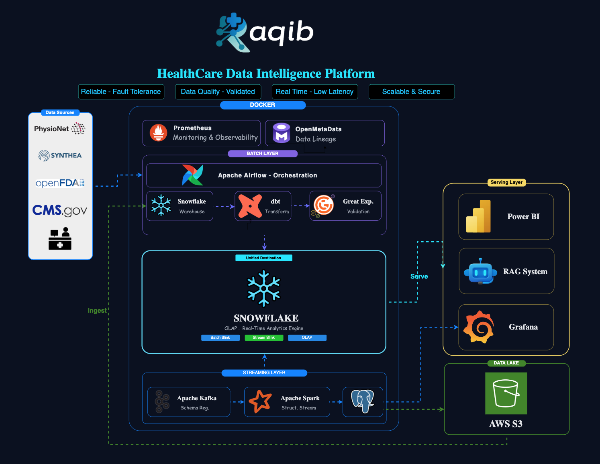
---

## 📁 Project Structure

```
Raqib/
├── 🐳 docker-compose.yml          # Full infrastructure — 17+ services with YAML anchors
├── 🔧 makefile                    # One-command shortcuts for all pipeline components
├── 📦 pyproject.toml              # Python project config (dbt-core, dbt-snowflake ~1.11)
├── 🔐 .env                        # Environment secrets (never commit this)
│
├── 🏥 ITI/                        # Core Kafka streaming pipeline
│   ├── config/
│   │   └── config.py              # Central config: brokers, topic names, producer/consumer dicts
│   ├── data/
│   │   └── data.py                # Sample patient seed data (SAMPLE_PATIENTS list)
│   ├── model/
│   │   └── models.py              # Python dataclasses: Patient, Admission, Diagnosis,
│   │                              #   Prescription, LabEvent, TransferEvent, Service, etc.
│   ├── producer/
│   │   └── receptionist_producer.py   # Produces Patient JSON → patients-topic (key=patient_id)
│   ├── consumer/
│   │   ├── doctor_consumer.py         # Consumes patients-topic, routes Path A/B/C
│   │   ├── second_doctor_consumer.py  # Consumes transfers-topic, handles specialist cases
│   │   └── lab_consumer.py            # Consumes LAB_REQUEST events, produces LAB_RESULT
│   ├── spark/
│   │   ├── patientConsumer.py         # Spark job: patients-topic → patients + emergency_contacts
│   │   ├── spark_admissions.py        # Spark job: admissions-topic → admissions, diagnosis,
│   │   │                              #            prescriptions, transfers (4 tables in 1 batch)
│   │   └── spark_lab.py               # Spark job: lab-results-topic (LAB_RESULT only) → lab_events
│   └── requirements.txt               # confluent-kafka==2.4.0, pyspark==3.5.0, psycopg2-binary
│
├── ✈️  Dags/
│   └── kafka_to_s3.py             # Airflow DAG: Postgres → S3 Parquet → Snowflake COPY INTO
│
├── ❄️  raqib_sf_dbt/               # dbt project targeting Snowflake (raqib_sf)
│   └── models/
│       ├── staging/               # 11 stg_ models — cleaning, typing, standardization
│       │   ├── stg_patients.sql
│       │   ├── stg_admissions.sql
│       │   ├── stg_providers.sql
│       │   ├── stg_lab_events.sql
│       │   ├── stg_diagnosis.sql
│       │   ├── stg_prescriptions.sql
│       │   ├── stg_transfers.sql
│       │   ├── stg_services.sql
│       │   ├── stg_emergency_contacts.sql
│       │   ├── stg_drugs.sql
│       │   ├── stg_lab_specimen_types.sql
│       │   └── schema.yml         # dbt tests: unique, not_null, accepted_values
│       ├── history/               # 4 int_ models — cross-domain joins, 1st-level metrics
│       │   ├── int_patients_360.sql      # Full patient profile + lifetime stats
│       │   ├── int_encounters.sql        # Admission context with provider + financials
│       │   ├── int_clinical_events.sql   # Chronological event stream (labs/dx/rx)
│       │   └── int_lab_analysis.sql      # Enriched lab results with specimen context
│       └── marts/
│           ├── dim/               # 9 dimension tables
│           │   ├── dim_patients.sql
│           │   ├── dim_provider.sql
│           │   ├── dim_date.sql
│           │   ├── dim_time.sql
│           │   ├── dim_location.sql
│           │   ├── dim_diagnosis.sql
│           │   ├── dim_admission_type.sql
│           │   ├── dim_lab_types.sql
│           │   └── dim_services.sql
│           ├── fact/              # 7 fact tables
│           │   ├── fact_encounters.sql
│           │   ├── fact_lab_results.sql
│           │   ├── fact_transfers.sql
│           │   ├── fact_clinical_events.sql
│           │   ├── fact_patient_finances.sql
│           │   ├── fact_patient_services.sql
│           │   └── fact_providers_performance.sql
│           └── schema.yml
│
├── 🤖 RAG/                        # Streamlit RAG chatbot (DocChat)
│   ├── App.py                     # Main entry — mode selection, state management
│   ├── config.py                  # Page config + CSS styling
│   ├── constants.py               # Model names, Snowflake creds, timeouts
│   ├── rag.py                     # chunk_text → embed → retrieve → generate pipeline
│   ├── snowflake.py               # Patient query mode — pulls records from Snowflake
│   ├── ollama.py                  # Ollama API interactions (chat + embeddings)
│   ├── ui.py                      # Streamlit UI components
│   ├── README.md
│   └── SETUP.md
│
├── 📊 Dashboard/
│   └── Raqib - Dashboard.pbix     # Power BI — 6 pages: Executive, Demographics,
│                                  #   Admissions, Financial, Diagnoses & Lab, Transfers
│
├── 📈 monitoring/
│   ├── prometheus.yml             # Prometheus scrape config (kafka-exporter + postgres-exporter)
│   └── grafana/
│       └── provisioning/          # Auto-provisioned Grafana datasources and dashboards
│
├── 🧪 tests/
│   └── dags/
│       └── test_dag_example.py    # Airflow DAG unit tests
│
└── 🔬 src/                        # Drug data pipeline scripts
    ├── download_drugs.py          # Downloads drug reference data from OpenFDA
    ├── extract_drugs.py           # Extracts and parses drug records
    ├── clean_drugs.py             # Initial drug data cleaning
    └── clean_drugs_v2.py          # Refined cleaning with standardized drug codes
```

---

## 🛠️ Tech Stack

### 🔴 Streaming Layer

| Component | Technology | Version | Purpose |
|---|---|---|---|
| Message Broker | Apache Kafka (Confluent Platform) | 7.6.3 | Fault-tolerant event bus, KRaft mode (no ZooKeeper) |
| Schema Management | Confluent Schema Registry | 7.6.1 | Avro schema enforcement for Kafka Connect |
| Kafka Connect | Confluent Kafka Connect | 7.6.3 | CDC from source Postgres (2 connect workers) |
| Kafka UI | provectuslabs/kafka-ui | latest | Cluster monitoring, topic inspection, consumer lag |
| Stream Processing | Apache Spark Structured Streaming | 3.5.3 | foreachBatch writes to Postgres, 10s micro-batches |
| Python Kafka Client | confluent-kafka | 2.4.0 | Producer/consumer in pure Python |

### 🟠 Batch Layer

| Component | Technology | Version | Purpose |
|---|---|---|---|
| Orchestration | Apache Airflow | 2.9.0 | Schedules daily Postgres → S3 → Snowflake ELT |
| Object Storage | AWS S3 | — | Data lake: Parquet files partitioned by date |
| Data Warehouse | Snowflake | — | OLAP engine, serves both batch sink and stream sink |
| Transformations | dbt-core + dbt-snowflake | ~1.11.0 | Staging → Intermediate → Galaxy Schema marts |
| Data Validation | Great Expectations | — | Quality checks on staging models |
| Data Lineage | OpenMetadata | — | Tracks model lineage across the warehouse |

### 🟡 Serving Layer

| Component | Technology | Purpose |
|---|---|---|
| BI Dashboard | Power BI | 6-page healthcare analytics dashboard |
| RAG Chatbot | Streamlit + Ollama (llama3) | Natural-language patient queries + document QA |
| Operational Dashboard | Grafana | Real-time Kafka lag + Postgres metrics |

### 🔵 Infrastructure

| Component | Technology | Purpose |
|---|---|---|
| Source Database | PostgreSQL (logical replication) | Hospital operational DB (port 5433) |
| DWH Database | PostgreSQL | Streaming sink / staging area (port 5434) |
| Monitoring | Prometheus + kafka-exporter + postgres-exporter | Metrics collection |
| Infra | Docker Compose | All 17+ services, YAML anchors for DRY broker config |

---

## ⚙️ Prerequisites & Environment Variables

### Prerequisites

- Docker Desktop (or Docker Engine + Compose v2)
- Python 3.10–3.13
- `uv` package manager (`pip install uv`) — or standard `pip`
- AWS account with S3 access (`raqib-streaming-pipeline-raw-bucket`)
- Snowflake account with a warehouse, database, and schema
- Ollama running locally with `llama3` and `nomic-embed-text` pulled

```bash
# Pull required Ollama models
ollama pull llama3
ollama pull nomic-embed-text
```

### Environment Variables

Create a `.env` file at the project root:

```env
# ── Source PostgreSQL ────────────────────────────────────────────
DATABASE_HOSTNAME_SOURCE=postgres
DATABASE_PORT=5432
DATABASE_USER_SOURCE=your_source_user
DATABASE_PASSWORD_SOURCE=your_source_password
DATABASE_DB_NAME_SOURCE=your_source_db

# ── DWH PostgreSQL (Streaming Sink) ─────────────────────────────
DATABASE_USER_DESTINATION=kafka_admin
DATABASE_PASSWORD_DESTINATION=kafka_admin_password
DATABASE_DB_NAME_DESTINATION=kafka_dwh

# ── pgAdmin ──────────────────────────────────────────────────────
PGADMIN_EMAIL=admin@admin.com
PGADMIN_PASSWORD=admin

# ── AWS S3 ───────────────────────────────────────────────────────
AWS_ACCESS_KEY_ID=your_access_key
AWS_SECRET_ACCESS_KEY=your_secret_key
S3_BUCKET_NAME=raqib-streaming-pipeline-raw-bucket

# ── Snowflake ────────────────────────────────────────────────────
SNOWFLAKE_USER=your_snowflake_user
SNOWFLAKE_PASSWORD=your_snowflake_password
SNOWFLAKE_ACCOUNT=your_account_identifier
SNOWFLAKE_WAREHOUSE=your_warehouse
SNOWFLAKE_DATABASE=your_database
SNOWFLAKE_SCHEMA=your_schema
```

---

## 🚀 Getting Started

**Step 1 — Start the full infrastructure:**

```bash
docker compose up -d
```

> ⏳ Wait ~60 seconds for all 3 Kafka brokers to complete their healthchecks before proceeding. Monitor with:

```bash
docker compose ps
# All broker services should show: healthy
```

**Step 2 — Run the Kafka streaming pipeline** (in order — see [Streaming Layer](#-streaming-layer))

**Step 3 — Trigger the Airflow DAG** for the batch pipeline

**Step 4 — Run dbt** to build the warehouse models

**Step 5 — Launch the RAG chatbot:**

```bash
cd RAG
streamlit run App.py
```

---

## 📡 Streaming Layer

### Kafka Cluster Setup

The cluster runs **3 brokers in KRaft mode** (no ZooKeeper) using Confluent Platform 7.6.3. All 3 nodes participate in the Raft controller quorum.

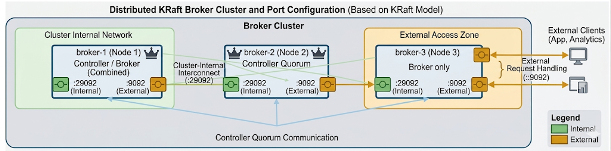

**Reliability guarantees:**

- `replication.factor=3` — every partition exists on all 3 brokers
- `min.insync.replicas=2` — at least 2 replicas must acknowledge writes
- `acks=all` on the producer — no data loss even if 1 broker goes down
- `enable.idempotence=True` — no duplicate messages on retry

### Kafka Topics & Producer Config

| Topic | Partitions | Replication | Producer | Consumer(s) | Key |
|---|---|---|---|---|---|
| `patients-topic` | 3 | 3 | `receptionist_producer` | `doctor_consumer` | `patient_id` |
| `admissions-topic` | 3 | 3 | `doctor_consumer` (Path A) | `spark_admissions` | `patient_id` |
| `transfers-topic` | 3 | 3 | `doctor_consumer` (Path B) | `second_doctor_consumer` | `patient_id` |
| `lab-results-topic` | 3 | 3 | `doctor_consumer` (Path C) + `lab_consumer` | `spark_lab` | `patient_id` |

**Producer configuration highlights** (`config/config.py`):

```python
PRODUCER_CONFIG = {
    "bootstrap.servers":  "broker-1:29092,broker-2:29092,broker-3:29092",
    "acks":               "all",            # wait for all ISR replicas
    "retries":            5,
    "retry.backoff.ms":   300,
    "linger.ms":          20,               # batch messages for 20ms
    "batch.size":         16384,
    "compression.type":   "lz4",            # compress batches
    "enable.idempotence": True,             # exactly-once semantics
}
```

**Consumer configuration** (manual commit, earliest offset):

```python
{
    "bootstrap.servers":  BOOTSTRAP_SERVERS,
    "group.id":           group_id,
    "auto.offset.reset":  "earliest",
    "enable.auto.commit": False,   # commit only after successful processing
}
```

### Doctor Consumer — Routing Logic

The `doctor_consumer.py` is the core clinical routing engine. It consumes `patients-topic` and sends each patient down one of three paths:

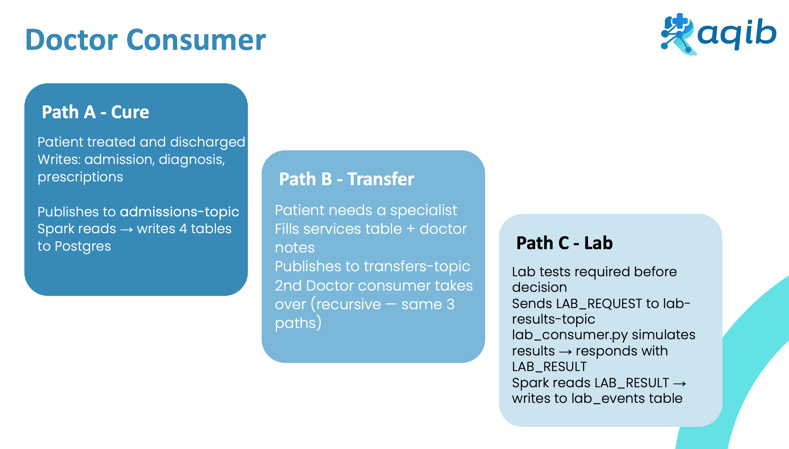

**Static provider details used by Doctor:**

- Provider ID: `PROV-DR-001` · Department: `General Medicine` · Room: `A101`
- Receiving provider (transfers): `PROV-DR-002` · Department: `Cardiology` · Room: `B205`
- Lab provider: `PROV-LAB-001`

### Lab Consumer

`lab_consumer.py` simulates a lab machine. It:

1. Subscribes to `lab-results-topic`
2. Filters only `event_type == "LAB_REQUEST"` messages
3. Calls `simulate_lab_results(test_name)` — returns `value`, `unit`, `range_lower`, `range_higher`, `abnormal_flag`
4. Builds a complete `LabEvent` dataclass with results
5. Re-produces `event_type="LAB_RESULT"` back to `lab-results-topic`

Spark's `lab_stream` then picks up the `LAB_RESULT` events and writes them to Postgres.

### 2nd Doctor Consumer

`second_doctor_consumer.py` handles transferred patients:

- Subscribes to `transfers-topic`
- Alternates between **Path A** (even `message_count`) and **Path C** (odd `message_count`) via a simple counter to avoid the infinite transfer loop
- **Path A** → Complete Admission + Diagnosis + Prescriptions (cardiac: Lisinopril, Metoprolol, Aspirin) → `admissions-topic`
- **Path C** → Requests cardiac labs (Troponin, BNP, Echocardiogram) → `lab-results-topic`
- Embeds `transfer_data` in the Path A message — Spark extracts it and writes to the `transfers` table

### Spark Streaming Jobs

All 3 jobs run inside the `spark-notebook` container with:

- `trigger=10 seconds`
- `maxOffsetsPerTrigger=100–200`
- `checkpointLocation=/tmp/spark-checkpoints/{job}`
- JDBC batch appends (atomic — no partial writes per micro-batch)

```
spark-submit packages:
  org.apache.spark:spark-sql-kafka-0-10_2.12:3.5.3
  org.postgresql:postgresql:42.7.1
```

| Job | Topic | Tables Written | Key Logic |
|---|---|---|---|
| `patientConsumer.py` | `patients-topic` | `patients`, `emergency_contacts` | Parse JSON → cast types → JDBC append |
| `spark_admissions.py` | `admissions-topic` | `admissions`, `diagnosis`, `prescriptions`, `transfers`* | Parse nested JSON; if `transfer_data` key present → also write transfers |
| `spark_lab.py` | `lab-results-topic` | `lab_events` | Filter `LAB_RESULT` only; convert `range_lower/higher` → `Decimal(10,4)` |

**Run order (must follow this sequence):**

```bash
# 1. Start consumers first (they need to be listening before producer fires)
make doctor          # doctor_consumer.py
make lab             # lab_consumer.py
make doctor2         # second_doctor_consumer.py

# 2. Start Spark streaming jobs
make spark-patients
make spark-admissions
make spark-lab

# 3. Fire the producer LAST — this kicks off the entire pipeline
make produce
```

---

## Streaming Layer - ELT Pipeline

### Airflow DAG: hospital_postgres_to_s3

**Schedule:** `@daily` | **Catchup:** False | **Retries:** 2

The DAG performs a one-to-one table export for 6 tables:
`admissions`, `diagnosis`, `lab_events`, `patients`, `prescriptions`, `transfers`

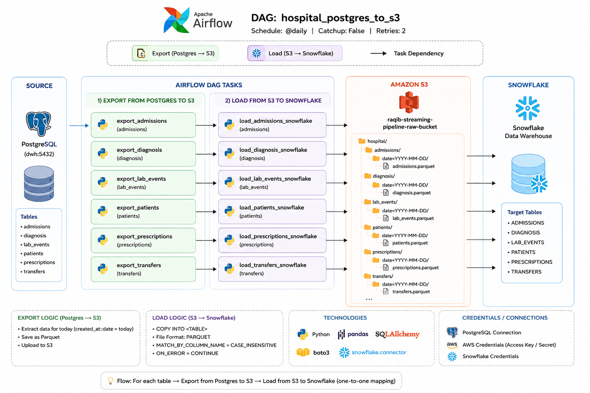

---

## Batch Layer - ELT Pipeline

### Airflow DAG: dbt_pipeline

**Schedule:** `@daily` | **Catchup:** False | **Retries:** 2

The DAG performs the full dbt pipeline:
`dbt debug`, `dbt run`, `dbt test`

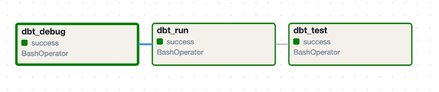

---

## ❄️ Snowflake + dbt Transformations

### RAW Layer

The first destination for all data. Stores records exactly as received with no transformations — preserves original values, timestamps, and enables full data lineage. Acts as the single source of truth.

### Staging Layer

Applies four categories of transformations on top of raw:

| Operation | What it does |
|---|---|
| **Standardization** | Unifies codes (ICD codes, blood types), units, and date formats across sources |
| **Data Cleaning** | Removes nulls, deduplicates, fixes format errors |
| **Validation** | Checks referential integrity (patient_id exists, admission_id valid) |
| **Quality Checks** | Flags anomalies, generates quality scores per record |

**All 11 staging models:**

```
stg_patients           stg_admissions         stg_providers
stg_lab_events         stg_diagnosis          stg_prescriptions
stg_transfers          stg_services           stg_emergency_contacts
stg_drugs              stg_lab_specimen_types
```
**Data Model**

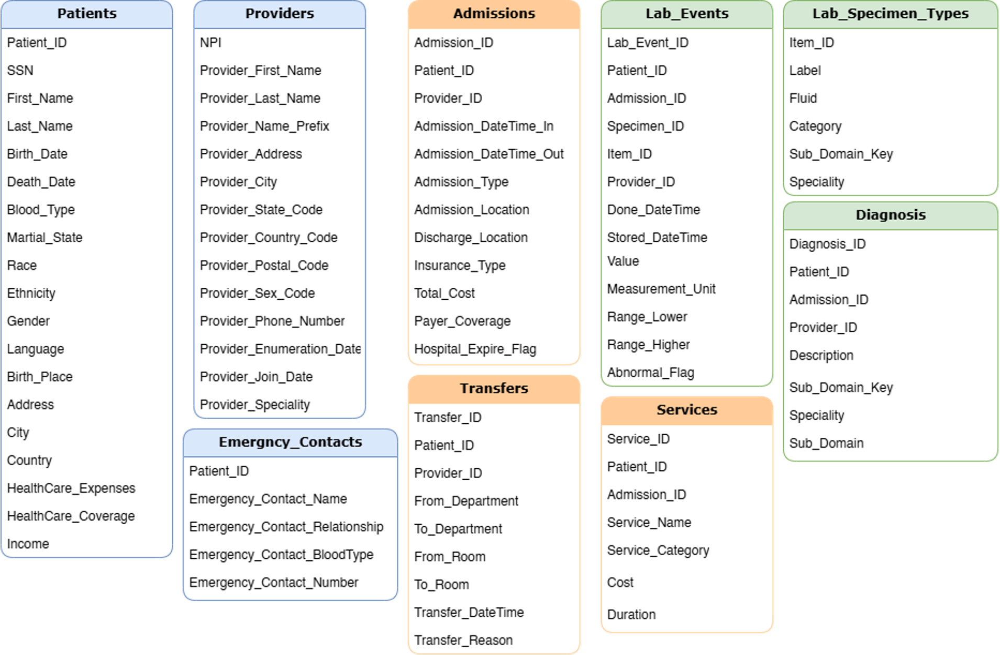

**Built-in dbt tests** (from `schema.yml`):

- `not_null` on every primary key and critical FK
- `unique` on all surrogate keys
- `accepted_values` for categorical fields (e.g. `abnormal_flag` must be `High|Low|Normal`)

### Intermediate Layer

> **Core Principle:** Not for reporting. Focus = building the business understanding layer.

Staging data is clean but **atomic and siloed** — one table per entity. The intermediate layer connects entities across domains:

| Model | What it joins | Key derived fields |
|---|---|---|
| `int_patients_360` | patients + admissions + emergency_contacts | `total_admissions`, `lifetime_total_cost`, `total_diagnoses`, `total_prescriptions`, `patient_status` |
| `int_encounters` | admissions + patients + providers | `length_of_stay_days`, `age_at_admission`, `age_group`, `coverage_percentage`, `out_of_pocket_cost`, `discharge_status` |
| `int_clinical_events` | admissions + diagnosis + events | Unified chronological event stream per patient |
| `int_lab_analysis` | lab_events + lab_specimen_types + providers | `category_type`, `category_sub_type`, `specialty_1`, `specialty_2`, full specimen context |
**Data Model**

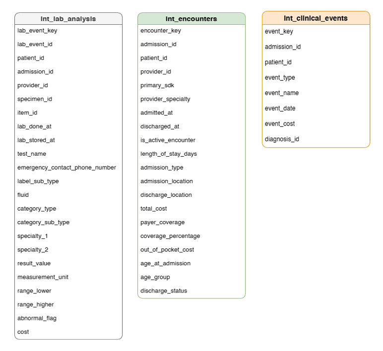

### Data Marts (Galaxy Schema)

The final consumption layer. Organized as a **Fact Constellation (Galaxy Schema)** — multiple fact tables sharing dimension tables — optimized for Power BI, Grafana, and the RAG chatbot.

**9 Dimension Tables** (the "who, when, where, how"):

| Dimension | Key fields |
|---|---|
| `dim_patients` | Patient_Key, Full_Name, DOB, Blood_Type, Race, Ethnicity, Marital_State, Language, City |
| `dim_provider` | Provider_Key, Full_Name, Specialty, State, Total_Encounters, Mortality_Rate |
| `dim_date` | Date_Key, Year, Month, Month_Name, Day_Name, Is_Weekend |
| `dim_time` | Time_Key, Hour, Minute, Second, Time_Of_Day |
| `dim_location` | Location_Key, Location_Name |
| `dim_diagnosis` | Diagnosis_Key, Type, Description, Sub_Domain_Key, Sub_Domain |
| `dim_admission_type` | Admission_Type_Key, Admission_Type |
| `dim_lab_types` | Specimen_Type_Key, Label, Sub_Type, Fluid, Category_Type, Specialty |
| `dim_services` | Service_Dim_Key, Service_Name, Sub_Type, Category |

**7 Fact Tables** (the "what happened"):

| Fact | Key measures |
|---|---|
| `fact_encounters` | Total_Cost, Payer_Coverage, Coverage_Percentage, Out_Of_Pocket_Cost, Length_Of_Stay_Days, Age_At_Admission |
| `fact_lab_results` | Result_Value, Measurement_Unit, Range_Lower, Range_Higher, Abnormal_Flag, Cost |
| `fact_transfers` | Transfer_DateTime, From/To_Department, Is_Same_Department_Transfer, Transfer_Reason |
| `fact_clinical_events` | Event_Type, Event_Name, Event_Date, Event_Cost |
| `fact_patient_finances` | HealthCare_Expenses, Coverage, Income_USD, Total_Admissions_Cost, Total_Payer_Coverage, Total_Out_Of_Pocket, Avg_Coverage_Percentage |
| `fact_patient_services` | Service_Duration_In_Minutes, Cost |
| `fact_providers_performance` | Total_Encounters, Unique_Patients, Total_Diagnoses, Total_Lab_Orders, Total_Prescriptions, Mortality_Rate |

**Data Model**

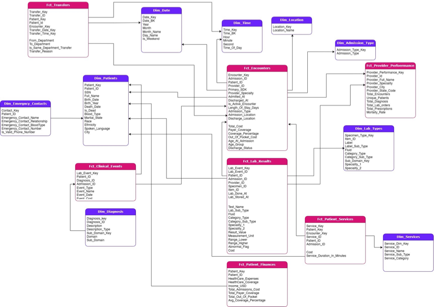

**Run dbt:**

```bash
# Install dependencies
uv sync
# or: pip install dbt-core dbt-snowflake

# Run all models in dependency order
dbt run

# Run all tests
dbt test

# Generate and serve docs
dbt docs generate
dbt docs serve
```

---

## 🤖 RAG Chatbot (DocChat)

A Streamlit application powered by local Ollama models. Supports two modes:

### Mode 1 — Document Upload

Upload any TXT, MD, or PDF file and ask questions about it.

```
Document → chunk_text() (overlapping word-level chunks)
         → embed() each chunk (nomic-embed-text)
         → Vector store {text, vector, id}
                    ↑
User question → embed() → retrieve() top-K chunks (cosine similarity)
                        → generate_answer() (chunks + question → llama3)
                        → Answer + source citations → chat history
```

### Mode 2 — Snowflake Patient Query

Type a patient name or ID to pull their complete record from Snowflake directly into the RAG context, then ask natural-language questions about their history, lab results, or admissions.

**Configuration** (in `constants.py`):

```python
DEFAULT_CHAT_MODEL  = "llama3"
DEFAULT_EMBED_MODEL = "nomic-embed-text"
DEFAULT_OLLAMA_URL  = "http://localhost:11434"
```

---

## 📊 Dashboards

### Power BI — 6-Page Healthcare Analytics Report

| Page | Key Metrics |
|---|---|
| **Onboarding** | Welcome + how-to-use guide |
| **Executive Overview** | Total Encounters (5.635M), Total Patients (115K), Total Revenue ($20.90bn), Encounters Over Year trend, Performance by Specialty |
| **Patient Demographics** | Patients by City (world map), Count by Race, Count by Language, Count by Age Group |
| **Admissions & Discharges** | Total Admissions (5.63M), Avg Duration of Stay (2.37 days), by Status, by Type, by Year/Month |
| **Financial Overview** | Total Healthcare Expenses ($20.90bn), Insurance Coverage ($13.27bn), Coverage Gap ($7.62bn), Avg Cost/Admission ($3.71K), Out-of-Pocket by Age Group |
| **Diagnoses & Lab Results** | Lab count by test name + abnormal flag, Labs by Specialty, Diagnosis count (500K) |
| **Transfers & Departments** | Transfers by Reason, Sankey diagram of inter-department patient flows |

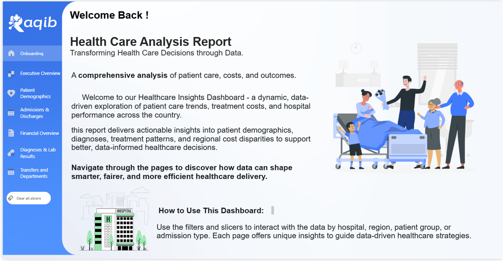

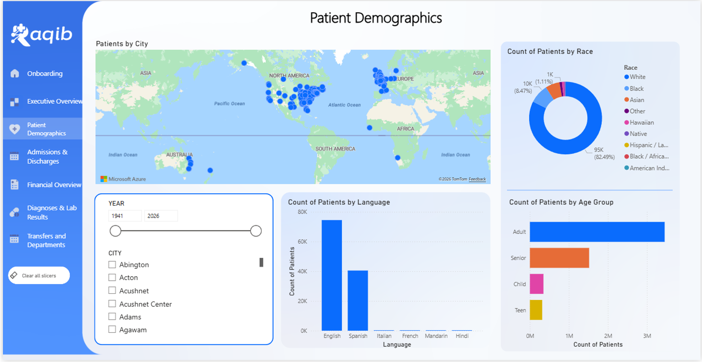

### Grafana — Real-Time Operational Dashboard

Live metrics from Prometheus, including:

- PostgreSQL Overview (connections, locks, transactions, query times)
- Kafka Overview (broker status, topic partition counts)
- Kafka Consumer Groups (lag per group per topic)
- Kafka Lag (end-to-end lag alerting)

---

## 🔭 Monitoring & Observability

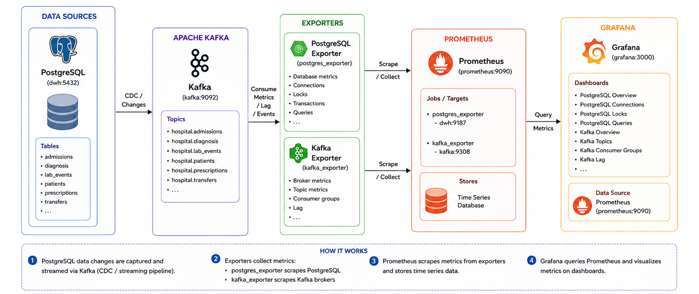

**What gets scraped:**

- `postgres-exporter` → DB metrics: table sizes, row counts, active connections, locks, query duration
- `kafka-exporter` → broker metrics: consumer lag, topic offsets, partition counts, under-replicated partitions

Grafana datasource and dashboards are **auto-provisioned** from `monitoring/grafana/provisioning/` on container startup.
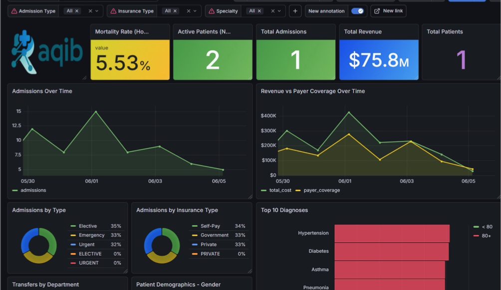

---

## 🗺️ Service Ports Reference

| Service | Port | URL |
|---|---|---|
| 🟢 Kafka Broker 1 | `9092` | `localhost:9092` |
| 🟢 Kafka Broker 2 | `9093` | `localhost:9093` |
| 🟢 Kafka Broker 3 | `9094` | `localhost:9094` |
| 🗂️ Schema Registry | `8081` | <http://localhost:8081> |
| 🔌 Kafka Connect 1 | `8083` | <http://localhost:8083> |
| 🔌 Kafka Connect 2 | `8084` | <http://localhost:8084> |
| 🖥️ Kafka UI | `8090` | <http://localhost:8090> |
| 🐘 Source Postgres | `5433` | `localhost:5433` |
| 🐘 DWH Postgres | `5434` | `localhost:5434` |
| 🛠️ pgAdmin | `5050` | <http://localhost:5050> |
| 🌟 Spark Notebook | `8888` | <http://localhost:8888> |
| 🔥 Spark UI | `4040` | <http://localhost:4040> |
| ✈️ Airflow | `8080` | <http://localhost:8080> |
| 🔮 SQLMesh | `8000` | <http://localhost:8000> |
| 🔭 Prometheus | `9090` | <http://localhost:9090> |
| 📊 Grafana | `3000` | <http://localhost:3000> (admin / admin123) |
| 📤 Kafka Exporter | `9308` | <http://localhost:9308/metrics> |
| 📤 Postgres Exporter | `9187` | <http://localhost:9187/metrics> |

---

## 📊 Data Model

The streaming layer writes to **8 normalized tables** in PostgreSQL. All child tables reference both `patient_id` and `admission_id` for fast reporting.

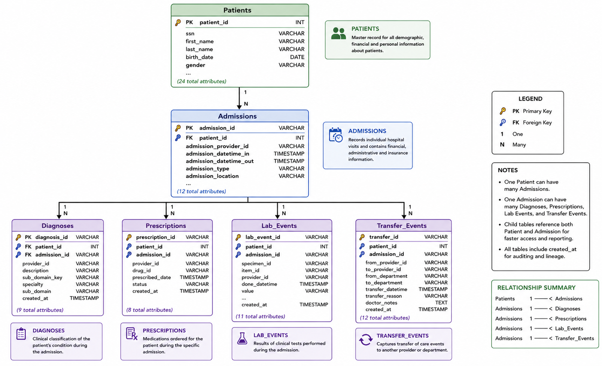

**Relationship summary:**

- One Patient → many Admissions
- One Admission → many Diagnoses, Prescriptions, Lab Events, Services, Transfer Events
- All tables include `created_at TIMESTAMP` for auditing and data lineage
- Foreign key constraints are dropped for streaming inserts (enforced at the dbt layer)

**Key model fields:**

| Table | Primary Key | Notable Columns |
|---|---|---|
| `patients` | `patient_id INT` | ssn, blood_type, race, ethnicity, healthcare_expenses, income (24 total) |
| `admissions` | `admission_id VARCHAR` | admission_type (EMERGENCY/URGENT/ELECTIVE), insurance_type, total_cost, hospital_expire_flag (13 total) |
| `diagnoses` | `diagnosis_id VARCHAR` | sub_domain_key, speciality, sub_domain |
| `prescriptions` | `prescription_id VARCHAR` | drug_id, status, prescribed_date |
| `lab_events` | `lab_event_id VARCHAR` | specimen_id, item_id, value, range_lower, range_higher, abnormal_flag |
| `services` | `service_id VARCHAR` | service_name, service_category, cost, duration |
| `transfer_events` | `transfer_id VARCHAR` | from_department, to_department, transfer_reason, doctor_notes |
| `emergency_contacts` | — | emergency_contact_name, relationship, blood_type, phone_number |

---

<div align="center">

**Built with ❤️ by Team Raqib — ITI Data Engineering Track**

*Sama Wael · Youssef Makram · Israa Ehab · Belal Waleed · Abdelrahman Karam*

</div>
